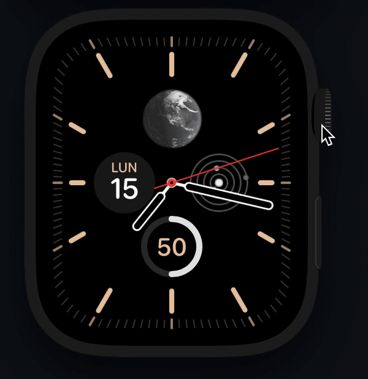
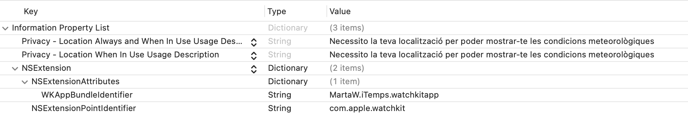
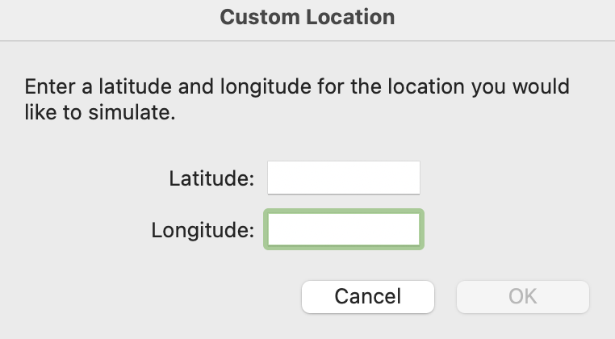
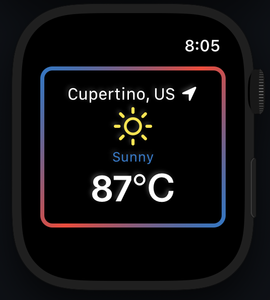

# iTemps 🌤

The idea behind this simple app is to understand the basis of **SwiftUI**, to work with **location tracking permission** and **location access**, use different **APIs calls** from WatchOS, and **monitorization of the location** changes

## Location Tracking Permission and Location Access

## Reverse geocoding for coordinates

***Currently working on this feature***

Using the Simulator that offers Xcode and via the option *Features->Location* of the simulator, iTemps can show you the desired weather given particular coordinates.

For the moment it fetches the data, but not working the Celcius-Fahrenheit conversion. Also for some cities, while querying the data the description for the weather is not available.

## APIs used

* [BigDataCloud API](https://www.bigdatacloud.com)
* [lil.software](https://lil.software/api/)
